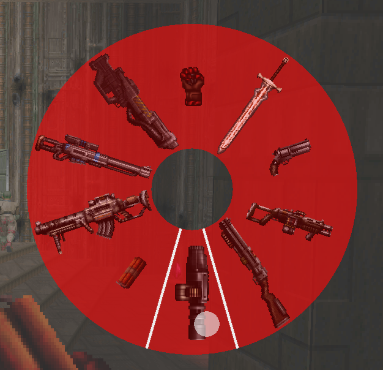
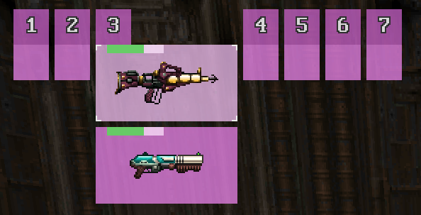

# Gearbox

Gearbox is an add-on for GZDoom engine that provides more convenient ways to
select weapons and items.

(Weapon Wheel with [Guncaster](https://forum.zdoom.org/viewtopic.php?f=43&t=37066))

(Blocks with [Treasure Tech](https://forum.zdoom.org/viewtopic.php?f=43&t=66995))

## How to use

GZDoom 4.5 required.

1. open the menu by assigned key, or by next/previous weapon keys, if enabled in
   options
2. select the weapon with next/previous weapon keys, or with mouse (wheel only)

## Features

- Two different representations: blocks and wheel
- Color and scale options
- Customizable behavior
- Multiplayer-compatible
- Reaction to number keys

## Planned

- Inventory item selection
- Patches for weapon icon adjustments
- More representations
- Moving weapon between slots and changing order
- Sounds for actions

## License

[GPLv3](copying.txt)

## Acknowledgments

- Thanks to Accensus and kadu522 for help with title selection.
- Blocky view is designed to resemble the weapon menu from Half-Life by Valve.
- Thanks to Marrub for [ZScriptDoc](https://github.com/marrub--/zdoom-doc).
- Thanks to Proydoha for feature requests and bug reports.
