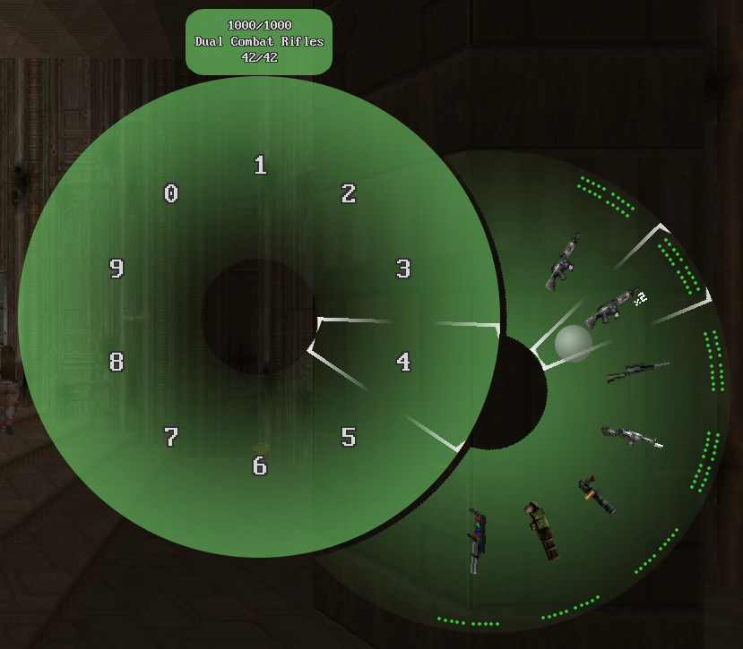

# Gearbox

Gearbox is an add-on for GZDoom engine that provides more convenient ways to
select weapons and items.

This mod is a part of [m8f's toolbox](https://mmaulwurff.github.io/pages/toolbox).

(Weapon Wheel with [Guncaster](https://forum.zdoom.org/viewtopic.php?f=43&t=37066))

(Blocks with [Treasure Tech](https://forum.zdoom.org/viewtopic.php?f=43&t=66995))

(Wheel with [HXRTC Project](https://forum.zdoom.org/viewtopic.php?f=43&t=48074))

## How to Use

GZDoom 4.5 required.

1. open the menu by assigned key, or by next/previous weapon keys, if enabled in
   options
2. select the weapon with next/previous weapon keys, or with mouse (wheel only)

## Features

- Two different representations: blocks and wheel
- Color and scale options
- Customizable behavior
- Multiplayer compatible
- Reaction to number keys
- extras.wad icon support for vanilla weapons

## Planned

- Inventory item selection
- Patches for weapon icon adjustments
- More representations
- Moving weapon between slots and changing order
- Sounds for actions

## Note for Weapon Mod Authors

If you want Gearbox to support your mod out of the box, assign
Inventory.AltHudIcon for your weapons! Tag property is also nice to have.

## Compatibility Issues

- [PyWeaponWheel v0.3](https://forum.zdoom.org/viewtopic.php?f=43&t=61061)
  overrides time freezing. If you are using both mods and want to freeze time
  with Gearbox, set PyWeaponWheel's option "Freeze when wheel is open"
  (`py_weaponwheel_freeze` CVar) to Off.

  Note that PyWeaponWheel may be built in some mods, for example in Project
  Brutality. The solution is the same: disable time PyWeaponWheel's time
  freezing.

## License

- code: [GPLv3](copying.txt)

## Acknowledgments

- Thanks to kadu522 for general help and support.
- Blocky view is designed to resemble the weapon menu from Half-Life by Valve.
- Thanks to Marrub for [ZScriptDoc](https://github.com/marrub--/zdoom-doc).
- Thanks to Talon1024 for help with time freezing option.
- Thanks to Player701 for help with key event processing code.
- Thanks to Accensus, Proydoha, mamaluigisbagel, TheRailgunner, Captain J, Enjay
  and krutomisi for feature suggestions.
- Thanks to Accensus, Proydoha, mamaluigisbagel, Ac!d, wildweasel,
  Dark-Assassin, rparhkdtp, Samarai1000 and Mr. Blazkowicz for bug reports.
- See also [credits list](credits.md).
